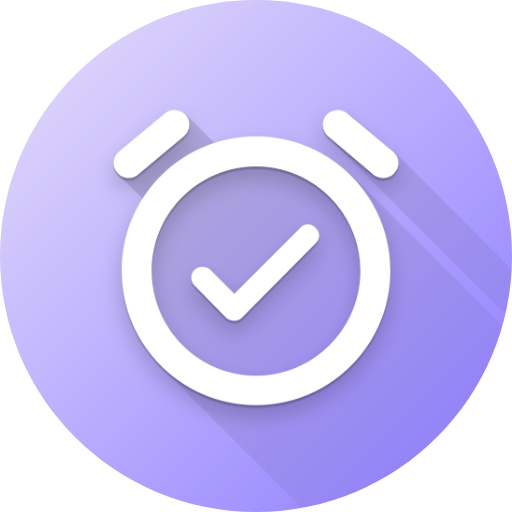

<a name="readme-top"></a>

<!--
*** I'm using markdown "reference style" links for readability.
*** Reference links are enclosed in brackets [ ] instead of parentheses ( ).
*** See the bottom of this document for the declaration of the reference variables
*** for contributors-url, forks-url, etc. This is an optional, concise syntax you may use.
*** https://www.markdownguide.org/basic-syntax/#reference-style-links
-->

<!-- PROJECT SHIELDS -->

<div align="center">

[![Contributors][contributors-shield]][contributors-url]
[![Forks][forks-shield]][forks-url]
[![Stargazers][stars-shield]][stars-url]
[![Issues][issues-shield]][issues-url]
[![MIT License][license-shield]][license-url]
<!-- [![LinkedIn][linkedin-shield]][linkedin-url] -->

<!-- PROJECT LOGO -->
<br />

  <a href="https://github.com/rachelleburgos/Timely">
    
  </a>

<h3 align="center">Timely</h3>
  <p align="center">
    An AI-powered scheduling app designed to help you manage your time and get more done.
    <br />
    <!-- <a href="https://github.com/rachelleburgos/Timely"><strong>Explore the docs »</strong></a> -->
    <br />
    <a href="https://github.com/rachelleburgos/Timely/releases">Releases</a>
    ·
    <a href="https://github.com/rachelleburgos/Timely/issues">Report Bug</a>
    ·
    <a href="https://github.com/rachelleburgos/Timely/issues">Request Feature</a>
  </p>
</div>

<br />

<!-- TABLE OF CONTENTS -->
<details>
  <summary>Table of Contents</summary>
  <ol>
    <li>
      <a href="#about-the-project">About The Project</a>
      <ul>
        <li><a href="#why-timely">Why Timely?</a></li>
        <li> <a href="#for-whom">For Whom?</a></li>
        <li><a href="#built-with">Built With</a></li>
      </ul>
    </li>
    <li>
      <a href="#getting-started">Getting Started</a>
      <ul>
        <li><a href="#prerequisites">Prerequisites</a></li>
        <li><a href="#installation">Installation</a></li>
      </ul>
    </li>
    <!-- <li><a href="#usage">Usage</a></li> -->
    <li><a href="#roadmap">Roadmap</a></li>
    <!-- <li><a href="#contributing">Contributing</a></li> -->
    <li><a href="#license">License</a></li>
    <!-- <li><a href="#contact">Contact</a></li> -->
    <li><a href="#acknowledgments">Acknowledgments & Resources</a></li>
  </ol>
</details>

<br />

<!-- ABOUT THE PROJECT -->
## About The Project

<!-- ![Product Screen Shot][product-screenshot] -->

**Timely** is an AI-powered scheduling application that redefines the approach to personal and professional time management. Unlike traditional scheduling tools, **Timely** stands out in the crowded market by not just organizing your tasks but also optimizing how you handle your workload.

### Why Timely?

In an era where productivity tools often add to our workload rather than reduce it, **Timely** offers a refreshing change. Here's what makes it unique:

* **AI-Driven Efficiency**: At its core, Timely harnesses advanced AI algorithms to analyze your work habits. It intelligently suggests an optimized schedule based on your past performance and preferences, helping you work smarter, not harder.

* **Personal Productivity Insights**: Timely goes beyond just scheduling tasks. It provides valuable insights into your productivity patterns, offering daily and weekly summaries that help you understand and improve your work habits.

* **Stress-Free Scheduling**: The app intuitively reschedules and prioritizes tasks, reducing the often overwhelming burden of manual planning. Its user-friendly interface ensures that managing your time is a seamless and stress-free experience.

* **Seamless Integration**: Designed to integrate effortlessly with existing tools and workflows, Timely syncs with other apps and services to bring all aspects of your schedule into one coherent picture.

<p align="right">(<a href="#readme-top">back to top</a>)</p>

### For Whom?

Timely is for everyone who seeks to take control of their time - from busy professionals juggling multiple deadlines to students managing their study schedules. It's more than an app; it's your personal time management assistant.

<p align="right">(<a href="#readme-top">back to top</a>)</p>

### Built With

* [![Electron][Electron]][Electron-url]
* [![React][React.js]][React-url]
* [![Vite][Vite]][Vite-url]
* [![Flask][Flask]][Flask-url]
* [![MongoDB][MongoDB]][MongoDB-url]
* [![Realm][Realm]][Realm-url]
* [![Python][Python]][Python-url]
* [![NPM][NPM]][NPM-url]
* ![JavaScript][JavaScript]

<p align="right">(<a href="#readme-top">back to top</a>)</p>

<!-- GETTING STARTED -->
## Getting Started

To get a local copy up and running follow these steps.

### Prerequisites

* npm

  ```sh
  npm install npm@latest -g
  ```

* API keys
  * In order to fully utilize the application's functionalities, you will need to obtain API keys from the following services:
    * [Google Cloud Platform](https://console.cloud.google.com/)
      * Create a new project in the Google Cloud Platform Console and enable OAuth 2.0 for the project. Follow the instructions [here](https://developers.google.com/identity/protocols/oauth2) to obtain a client ID and secret. In order to integrate Google authentication with MongoDB Realm, please follow the instructions under the MongoDB section below.
    * [Sentry](https://sentry.io/)
      * Create a new project in Sentry and obtain a DSN.
    * [MongoDB](https://www.mongodb.com/cloud/atlas)
      * You will need to create a MongoDB Cluster and enable Device Sync. You will also need to [enable email/password authentication](https://www.mongodb.com/docs/atlas/app-services/authentication/email-password/#std-label-email-password-authentication) as well as [Google authentication](https://www.mongodb.com/docs/atlas/app-services/authentication/google/).

### Installation

1. Clone the repository

   ```sh
   git clone https://github.com/rachelleburgos/Timely.git
   ```

2. Enter the project directory's client folder

   ```sh
   cd Timely/client
   ```

3. Create a `.env` file in the root of the client folder and add the following:

    ```sh
    ELECTRON_VITE_SENTRY_DSN=<YOUR_SENTRY_DSN>
    RENDERER_VITE_GOOGLE_CLIENT_ID=<YOUR_GOOGLE_CLIENT_ID>
    RENDERER_VITE_GOOGLE_SECRET=<YOUR_GOOGLE_SECRET>
    RENDERER_VITE_REALM_APP_ID=<YOUR_REALM_APP_ID>
    ```

4. Install NPM packages

   ```sh
   npm install
   ```

5. Build the project

   * For Windows

    ```sh
      npm run build:win
    ```

   * For MacOSX

   ```sh
    npm run build:mac
    ```

    * For Linux

    ```sh
    npm run build:linux
    ```

<p align="right">(<a href="#readme-top">back to top</a>)</p>

<!-- USAGE EXAMPLES -->
<!-- ## Usage

Use this space to show useful examples of how a project can be used. Additional screenshots, code examples and demos work well in this space. You may also link to more resources. -->

<!-- _For more examples, please refer to the [Documentation](https://example.com)_ -->

<!-- <p align="right">(<a href="#readme-top">back to top</a>)</p> -->

<!-- ROADMAP -->
## Roadmap

Below is an outline of planned features and enhancements.

* [ ] Migration to TypeScript
* [ ] Add testing frameworks
* [ ] Add CI/CD using GitHub Actions
* [ ] Add integration with other calendar services
* [ ] Add support for mobile devices
* [ ] Add support for web browsers
* [ ] Account for mood and energy levels when scheduling tasks
* [ ] Account for geographical location when scheduling tasks
* [ ] Account for uncompleted tasks when scheduling tasks
* [ ] Add support for recurring tasks
* [ ] Add support for subtasks
* [ ] Add support for task dependencies
* [ ] Add support for task prioritization
* [ ] Add support for task categorization
* [ ] Accessibility improvements
* [ ] Add support for multiple languages

<!-- See the [open issues](https://github.com/rachelleburgos/Timely/issues) for a full list of proposed features (and known issues). -->

<p align="right">(<a href="#readme-top">back to top</a>)</p>

<!-- CONTRIBUTING -->
<!-- ## Contributing

Contributions are what make the open source community such an amazing place to learn, inspire, and create. Any contributions you make are **greatly appreciated**.

If you have a suggestion that would make this better, please fork the repo and create a pull request. You can also simply open an issue with the tag "enhancement".
Don't forget to give the project a star! Thanks again!

1. Fork the Project
2. Create your Feature Branch (`git checkout -b feature/AmazingFeature`)
3. Commit your Changes (`git commit -m 'Add some AmazingFeature'`)
4. Push to the Branch (`git push origin feature/AmazingFeature`)
5. Open a Pull Request -->

<!-- <p align="right">(<a href="#readme-top">back to top</a>)</p> -->

<!-- LICENSE -->
## License

Distributed under the MIT License. See `LICENSE.txt` for more information.

<p align="right">(<a href="#readme-top">back to top</a>)</p>

<!-- CONTACT -->
<!-- ## Contact

Your Name - [@twitter_handle](https://twitter.com/twitter_handle) - <email@email_client.com>

Project Link: [https://github.com/rachelleburgos/Timely](https://github.com/rachelleburgos/Timely) -->

<!-- <p align="right">(<a href="#readme-top">back to top</a>)</p> -->

<!-- ACKNOWLEDGMENTS -->
## Acknowledgments & Resources

* [FullCalendar](https://fullcalendar.io/): Calendar library used for the main dashboard's calendar
* [Formik](https://formik.org/): Form library used for the login and signup forms
* [Yup](https://github.com/jquense/yup): Form validation library used for the login and signup forms in conjunction with Formik
* [React Router](https://reactrouter.com/): Routing library used for the application
* [Flowbite React](https://flowbite.com/react/): UI library used for the application
* [Protocol Registry](https://github.com/Shubham-Kumar-2000/protocol-registry): Protocol registry used for redirecting the user to the application after authenticating with Google
* [Font Awesome](https://fontawesome.com): Icons used for the application
* [Image Shields](https://shields.io): Shields used for the README
* [README Template](https://github.com/othneildrew/Best-README-Template/tree/master): README template used for this README 😉


<!-- <p align="right">(<a href="#readme-top">back to top</a>)</p> -->

<!-- MARKDOWN LINKS & IMAGES -->
<!-- https://www.markdownguide.org/basic-syntax/#reference-style-links -->
[contributors-shield]: https://img.shields.io/github/contributors/rachelleburgos/Timely.svg?style=for-the-badge
[contributors-url]: https://github.com/rachelleburgos/Timely/graphs/contributors

[forks-shield]: https://img.shields.io/github/forks/rachelleburgos/Timely.svg?style=for-the-badge
[forks-url]: https://github.com/rachelleburgos/Timely/network/members

[stars-shield]: https://img.shields.io/github/stars/rachelleburgos/Timely.svg?style=for-the-badge
[stars-url]: https://github.com/rachelleburgos/Timely/stargazers

[issues-shield]: https://img.shields.io/github/issues/rachelleburgos/Timely.svg?style=for-the-badge
[issues-url]: https://github.com/rachelleburgos/Timely/issues

[license-shield]: https://img.shields.io/github/license/rachelleburgos/Timely.svg?style=for-the-badge
[license-url]: https://github.com/rachelleburgos/Timely/blob/master/LICENSE.txt

[product-screenshot]: https://i.imgur.com/U079MsE.jpg

[React.js]: https://img.shields.io/badge/react-%2320232a.svg?style=for-the-badge&logo=react&logoColor=%2361DAFB
[React-url]: https://react.dev/

[Electron]: https://img.shields.io/badge/Electron-191970?style=for-the-badge&logo=Electron&logoColor=white
[Electron-url]: https://www.electronjs.org/

[Flask]: https://img.shields.io/badge/flask-%23000.svg?style=for-the-badge&logo=flask&logoColor=white
[Flask-url]: https://flask.palletsprojects.com/en/

[Vite]: https://img.shields.io/badge/vite-%23646CFF.svg?style=for-the-badge&logo=vite&logoColor=white
[Vite-url]: https://vitejs.dev/

[NPM]: https://img.shields.io/badge/NPM-%23CB3837.svg?style=for-the-badge&logo=npm&logoColor=white
[NPM-url]: https://www.npmjs.com/

[Realm]: https://img.shields.io/badge/Realm-39477F?style=for-the-badge&logo=realm&logoColor=white
[Realm-url]: https://realm.io/

[MongoDB]: https://img.shields.io/badge/MongoDB-%234ea94b.svg?style=for-the-badge&logo=mongodb&logoColor=white
[MongoDB-url]: https://https://www.mongodb.com/

[JavaScript]: https://img.shields.io/badge/javascript-%23323330.svg?style=for-the-badge&logo=javascript&logoColor=%23F7DF1E

[Python]: https://img.shields.io/badge/python-3670A0?style=for-the-badge&logo=python&logoColor=ffdd54
[Python-url]: https://www.python.org/
